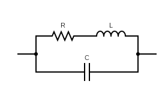
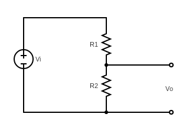
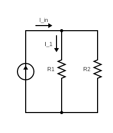

# Elettrotecnica generale

## Testi:

* Mazzoldi Nigro Voci - Elementi di fisica: elettromagnetismo
* Fabricatore - Elettrotecnica e applicazioni

## Campo elettrico, magnetico ed elettromagnetico

##### Costanti

Costante dielettrica del vuoto o permittività elettrica del vuoto:

$$
\varepsilon _{0}=8,85\cdot 10^{-12}\ \frac{\mathrm {F}}{\mathrm {m}}
$$

$$
\mu _{0}=4\pi\cdot 10^{-7}\ \frac{\mathrm {N}}{\mathrm {A}^2}
$$

##### Campo elettrico

L' intensità della forza esercitata tra due cariche puntiformi q1e q2 vale:

$$
F={\frac {1}{4\pi \epsilon_0}} \frac {q_1 q_2}{r^2}
$$

Il potenziale elettrostatico generato da una carica puntiforme $q$ in un punto a distanza $r$ vale:

$$
V(r)={\frac {q}{4\pi \epsilon_0 r}}
$$

Il lavoro svolto dalla forza elettrostatica per portare $q_0$ da $A$ a $B$ è dato da:

$$
W_{AB}={-q_0(V_B - V_A) = -q_0ΔV}
$$

La carica accumulata sulle armature di un condensatore è pari a:

$$
 q = CV
$$

L'energia elettrostatica del condensatore di capacità $C$, carico con carica $q$ e differenza di potenziale $V$ vale:

$$
U_e = \frac {1}{2} CV^2 = \frac {1}{2} \frac {q^2}{C}  = \frac {1}{2} qV
$$

* La rigidità dielettrica è definita come il massimo valore del campo elettrico a cui può essere sottoposto il materiale isolante, oltre il quale si produce una scarica nel materiale, ovvero si innesca un fenomeno di conduzione elettrica.

* In un mezzo omogeneo ed isotropo la relazione fra il campo elettrico $\mathbf E$ ed il campo di induzione elettrica $\mathbf D$ vale:

$$
\mathbf D = \epsilon_0 \epsilon_r \mathbf E
$$

* La conducibilità $\sigma$ in un conduttore ohmico è il rapporto fra la densità di corrente $\mathbf j$ in un conduttore e il campo elettrico $\mathbf E$ che la genera. Essa è pari all’inverso della resistività $\rho$
  
$$
\mathbf j = \sigma  \mathbf E
$$

$$
\mathbf{E} = \rho \mathbf j
$$

* L'unità di misura del campo di induzione elettrico $\mathbf D$ è il $\text{C}/\text{m}^2$

* Il dipolo elettrico è un sistema di 2 cariche elettriche uguali ed opposte

##### Campo magnetico

La legge di Felici afferma che la differenza tra il flusso del campo magnetico concatenato al circuito nello stato iniziale ed il flusso nello stato finale, divisa per la resistenza del circuito, è pari alla carica totale $Q(t)$ che attraversa il circuito. 

$$
Q(t)={\frac {1}{R} [Φ_i-Φ_f]} = {\frac {NS\overline{B}}{R}}
$$

dove $Φ_i$ è il flusso iniziale,$Φ_f$ è il flusso finale, $\overline{B}$ è il campo magnetico medio all'interno della spira, $N$ è il numero di spire e $S$ è la sezione delle spire.

* La riluttanza magnetica misura l'opposizione di un materiale al transito di un flusso magnetico. Si misura in $H^{-1}$
* L'unità di misura del campo magnetico $\mathbf H$ è $\text{A}/\text{m}$
* Il Tesla è l’unità di misura dell’intensità del campo di induzione magnetica ed equivale a $T = Wb/m^2$
* il Weber è l’unità di misura del flusso magnetico
* In un mezzo omogeneo ed isotropo la relazione fra il campo magnetico $\mathbf H$ ed il campo di induzione magnetica $\mathbf B$ vale:

$$
\mathbf B = \mu_0 \mu_r \mathbf H
$$

* Il ciclo di isteresi di un materiale ferromagnetico descrive la variazione del campo magnetico $\mathbf H$ all’interno del materiale in funzione del campo di induzione magnetica totale $\mathbf B$.

##### Campo elettromagnetico

Equazioni di Maxwell

| Nome        | Formula |
| ----------- | ----------- |
| Legge di Gauss      | $\nabla \cdot \mathbf E = \frac {\rho} {\epsilon_0}$       |
| Legge di Farady   | $\nabla \times \mathbf E = - \frac{\partial \mathbf B}{\partial t}$ |
| Legge di Gauss   | $\nabla \cdot \mathbf B = 0$ |
| Legge di Ampèere-Maxwell   | $\nabla \times \mathbf B=\left(j + \epsilon_0 \frac{\partial \mathbf E}{\partial t} \right)$ |

Proprietà di Gradiente, Divergenza e Rotore

* Il rotore del gradiente di $\phi$ è nullo

$$
\nabla \times (\nabla\phi) = 0
$$

* La divergenza del rotore di $ \mathbf{A}$ è nulla

$$
\nabla \cdot (\nabla \times \mathbf{A}) = 0
$$

* Il laplaciano di una funzione è dato da:

$$
\nabla^2 \mathbf{A} = \nabla  (\nabla \cdot \mathbf{A}) - \nabla \times (\nabla \times \mathbf{A})
$$

## Componenti elettrici delle reti elettriche

* Gaetano Conte - Corso di elettrotecnica ed elettronica Volume 2 (Modulo A1, A2)

##### Resistore

* 1° Legge di Ohm.

$$
R=\frac{V}{I}\quad[\Omega]
$$

$$
G=\frac{I}{V}\quad[\text{S}]
$$

* 2° Legge di Ohm. La resisitività $\rho$ ha come unità di misura $\Omega \cdot \text{m}$

$$
R=\rho \frac{l}{S}
$$

* La resistenza equivalente di una serie di resitori vale:

$$
R_s = R_1 + R_2 + \ldots + R_n
$$

* La resistenza equivalente del parallelo di più resistori vale:

$$
\frac {1}{R_p} = \frac {1}{R_1} + \frac {1}{R_2} + \ldots + \frac {1}{R_n}
$$

* Circuito equivalente del resistore reale:

  

##### Condensatore

* La carica accumulata sulle armature di un condensatore è pari a:

$$
 q = CV
$$

L'energia elettrostatica del condensatore di capacità $C$, carico con carica $q$ e differenza di potenziale $V$ vale:

$$
U_e = \frac {1}{2} CV^2 = \frac {1}{2} \frac {q^2}{C}  = \frac {1}{2} qV
$$

* La capacità equivalente di una serie di condensatori vale:

$$
\frac {1}{C_s} = \frac {1}{C_1} + \frac {1}{C_2} + \ldots + \frac {1}{C_n}
$$

* La capacità equivalente del parallelo di più condensatori vale:

$$
C_p = C_1 + C_2 + \ldots + C_n
$$

* La capacità di un condensatore cilindrico vale:
$$
C = 2 \pi  \epsilon_0 \epsilon_R\frac{l}{\text{ln} (r_E/r_I) }
$$
l è la lunghezza $r_I$ ed $r_E$ i raggi interni ed esterni.
 
* La capacità di un condensatore piano costituito da due piastre di area $A$ e distanza $d$ vale:

$$
C = \epsilon_0 \epsilon_R \frac{A}{d}
$$

* Un condensatore ideale alimentato in corrente continua è a regime un circuito aperto mentre un condensatore reale si comporta come una resistenza di grande dimensione.

* La corrente che attraversa un condensatore vale:

$$
I_C = C \frac{dV_C}{dt}
$$

Quindi, un condensatore fornisce una tensione a rampa se viene alimentato a corrente costante

##### Induttore

L'energia immagazzinata in un induttore di induttanza $L$ vale:

$$
U_e = \frac {1}{2} LI^2
$$

* L'induttanza equivalente di una serie di induttori vale:

$$
L_s = L_1 + L_2 + \ldots + L_n
$$

* L'induttanza  equivalente del parallelo di più induttori vale:

$$
\frac {1}{L_p} = \frac {1}{L_1} + \frac {1}{L_2} + \ldots + \frac {1}{L_n}
$$

* Un induttore ideale alimentato in corrente continua è a regime un cortocircuito mentre un induttore reale si comporta come una resistenza.

* La tensione ai capi di un induttore vale:

$$
V_L = L \frac{dI_L}{dt}
$$

* Il coefficiente di autoinduzione di un solenoide vale:

$$
L = \mu_0 \cdot \frac{N^2 \cdot S}{l}
$$

##### Generatori di tensione

* Due generatori di tensione non possono mai essere collegati in parallelo, perchè imporrebbe alle tensioni di essere identiche.

##### Generatori di corrente

* Due generatori di corrente non possono mai essere collegati in serie, perchè imporrebbe alle correnti di essere identiche.

## Leggi, principi e metodi per la risoluzione delle reti elettriche in regime continuo e sinusoidale

* Gaetano Conte - Corso di elettrotecnica ed elettronica Volume 2 (Modulo A2, B, C, D)

##### Le leggi di Kirchoff

 * I° legge: la somma delle correnti entranti in un nodo di rete elettrica è uguale alla somma delle correnti uscenti. É equivalente al principio della conservazione della carica.
 * II° legge: la somma algebrica delle tensioni in maglia di una rete elettrica è uguale a zero. É una forma di conservazione dell'energia.

Per risolvere una rete elettrica con $r$ rami e $n$ nodi, si deve scrivere un sistema di r equazioni composto da:

* $n – 1$ equazioni con il la I° legge
* $r – (n – 1)$ con il II° legge

Se in una rete elettrica siano presenti più di un generatore (di corrente o di tensione) si sfrutta il principio di sovrapposizione degli effetti. Questo afferma che in una rete lineare in cui sono presenti più generatori, le correnti nei singoli rami possono essere ottenute sommando algebricamente le correnti risultanti dai singoli generatori. I generatori di tesnione esclusi sono sostiuiti da un cortocircuito, mente i generatori di corrente esclusi con dei circuiti aperti.

##### Partitore di tensione

  

$$
V_o = V_i\frac{R_2}{R1+R2}
$$

##### Partitore di corrente

  

$$
I_1 = I_{in}\frac{R_2}{R1+R2}
$$

##### Generatore equivalente di Thevenin

Il Teorema di Thevenin afferma che è possibile sostituire una rete attiva lineare con un generatore di tensione avente come valore la tensione a vuoto della rete, e come resistenza interna serie quella vista dai due morsetti, sostituendo i generatori di tensione con dei corto circuiti ed i generatori di corrente con dei circuiti aperti.

##### Generatore equivalente di Norton

Il Teorema di Norton afferma che è possibile sostituire una rete attiva lineare con un generatore di corrente avente come valore quello ottenuto cortocircuitando i morsetti, e come resistenza interna parallelo quella vista dai due morsetti, sostituendo i generatori di tensione con dei corto circuiti ed i generatori di corrente con dei circuiti aperti.

## Sistemi monofase e trifase

* Gaetano Conte - Corso di elettrotecnica ed elettronica Volume 2 (Modulo A, B)

## Bilancio energetico nelle reti elettriche

* Gaetano Conte - Corso di elettrotecnica ed elettronica Volume 2 (Modulo A, B)

* L'unità di misura della potenza reattiva è il VAR, ovvero Volt Amper Reattivi.

* La potenza elettrica dissipata per effetto Joule in un resistore vale:

$$
  P = RI^2
$$

* L'energia elettrica dissipata per effetto Joule in un resistore vale:

$$
  W = RI^2\Delta t 
$$

## Analisi dei circuiti elettrici in regime variabile

* Gaetano Conte - Corso di elettrotecnica ed elettronica Volume 2 (Modulo A, B)

* La costante di tempo di un circuito RC vale:

$$
  \tau = RC
$$

* La costante di tempo di un circuito RL vale:

$$
  \tau = \frac{L}{R}
$$