# Fondamenti di elettronica analogica

## Componenti a semiconduttore: principi di funzionamento e applicazioni

* Gaetano Conte - Corso di elettrotecnica ed elettronica Volume 2 (Modulo E)

**Limitatore a diodi**

  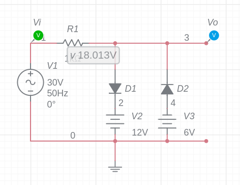

  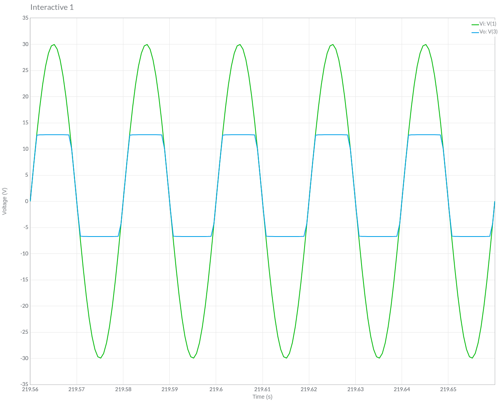

**Limitatore a diodi 2**

  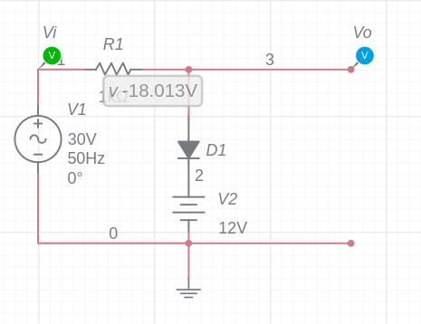

  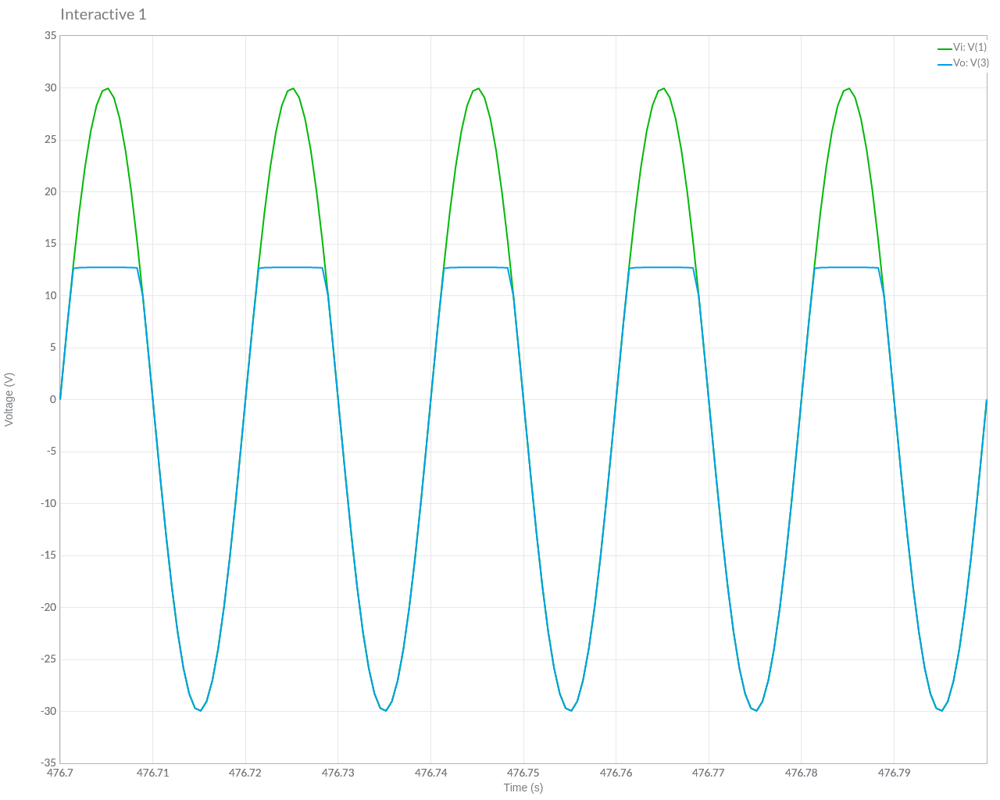

**Diffusione elettrica in un semiconduttore**

Il fenomeno della diffusione elettrica ha luogo, in un semiconduttore, a causa di un gradiente di concentrazione dei portatori di carica. Consiste in un moto di cariche che si spostano da una regione dove sono in eccesso verso zone a minore densità di concentrazione, indipendentemente dall'eventuale presenza di campi elettrici.

**Diodo Zener**

Il diodo Zener è un tipo di diodo a giunzione p-n, il cui comportamento è determinato dalla combinazione dell'effetto Zener e dell'effetto di breakdown a valanga, ed è caratterizzato dalla tensione Zener $\text{V}_z$, corrispondente alla tensione di breakdown, nonché dalla temperatura di lavoro. Viene spesso usato in polarizzazione inversa come elemento di riferimento della tensione al valore $\text{V}_z$ e trova applicazione come stabilizzatore di tensione. Può essere usato anche in polarizzazione diretta.

**Circuito di esempio**

  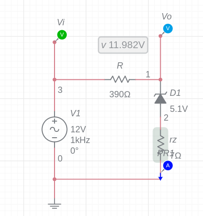

* Quando la tensione $V_i$ è negativa, il diodo Zener è polarizzato direttamente. La tensione $V_o$ vale circa 0.7V e la corrente è negativa

* Quando la tensione $V_i$ è positiva e minore di $V_Z$, il diodo Zener è polarizzato inversamente. La tensione $V_o$ è circa V_i$ e la corrente nel diodo quasi 0

* Quando la tensione $V_i$ è positiva e maggiore di $V_Z$, il diodo Zener è polarizzato inversamente. La tensione $V_o$ è pari a $V_Z$ e la corrente nel diodo positiva.

  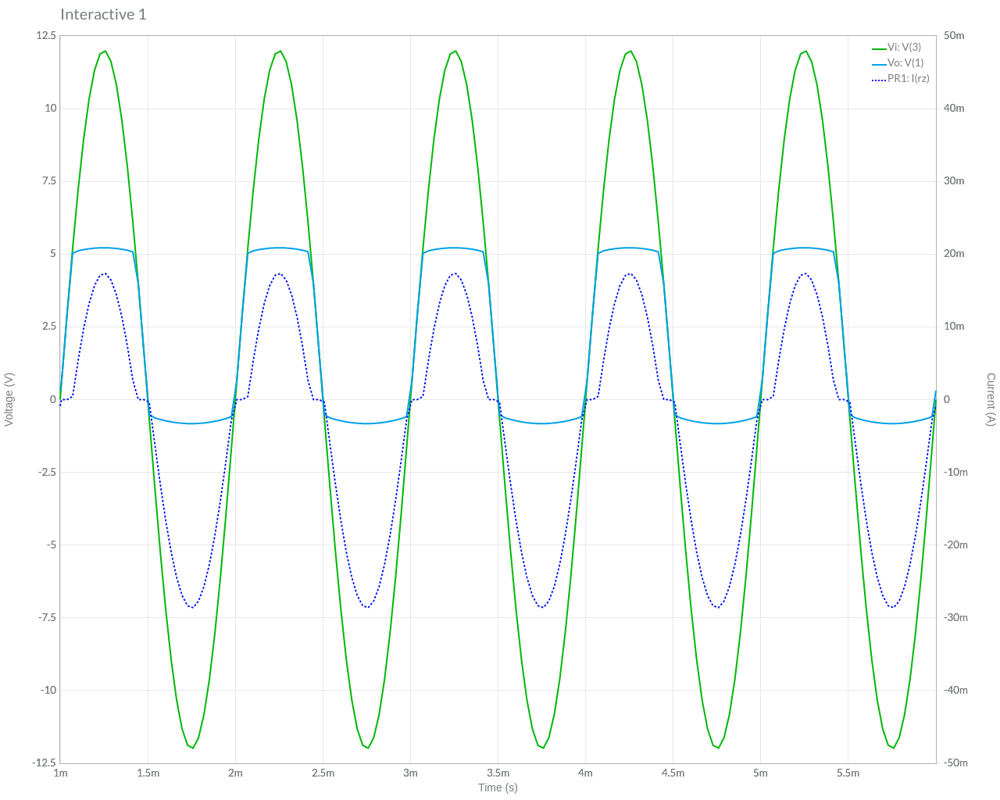

**Transistor BJT**

| Zona di funzionamento | Giunzione Base Emettitore | Giunzione Base Collettore |
| ----------- | ----------- | ----------- |
| Zona attiva diretta      | Polarizzazione diretta       | Polarizzazione inversa       |
| Zona attiva inversa   | Polarizzazione inversa        | Polarizzazione diretta        |
| Interdizione   | Polarizzazione inversa        | Polarizzazione inversa        |
| Saturazione   | Polarizzazione diretta        | Polarizzazione diretta        |

**Collettore comune**

In questa configurazione l’amplificazione Vu / Vi vale circa 1

  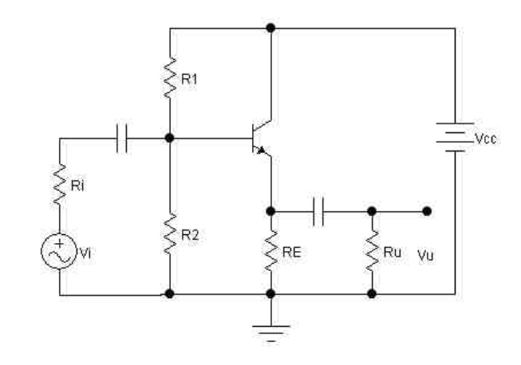

## Amplificatori di tensione, di corrente e di potenza

## Amplificatori retroazionati: proprietà e stabilità

* Ambrosini - Telecomunicazioni (Uda 6)

## Amplificatori operazionali: applicazioni lineari e non.

* Gaetano Conte - Corso di elettrotecnica ed elettronica Volume 2 (Modulo G)

**Trigger di Schmitt**

  

L'isteresi vale:

$$
H = V_{th(H)} - V_{th(L)} = 2 V_{sat}\frac{R_G}{R_F+R_G}
$$

**Trigger di Schmitt non invertente con caratteristica traslata**

  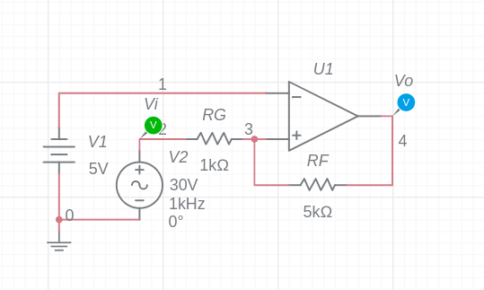

  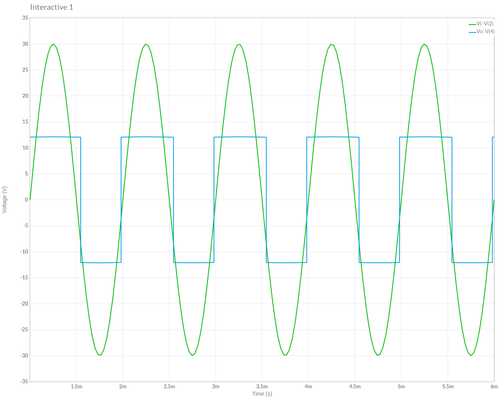

Le soglie possono essere calcolate:

$$
V_{th(L)} = - V_{sat} \frac{R_G}{R_F} + V_{off} \frac{R_F+R_G}{R_F}
$$

$$
V_{th(H)} = V_{sat} \frac{R_G}{R_F} + V_{off} \frac{R_F+R_G}{R_F}
$$

L'isteresi quindi vale:

$$
H = V_{th(H)} - V_{th(L)} = 2 V_{sat} \frac{R_G}{R_F}
$$

**Rivelatore di picco**

  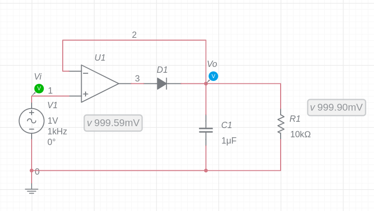

  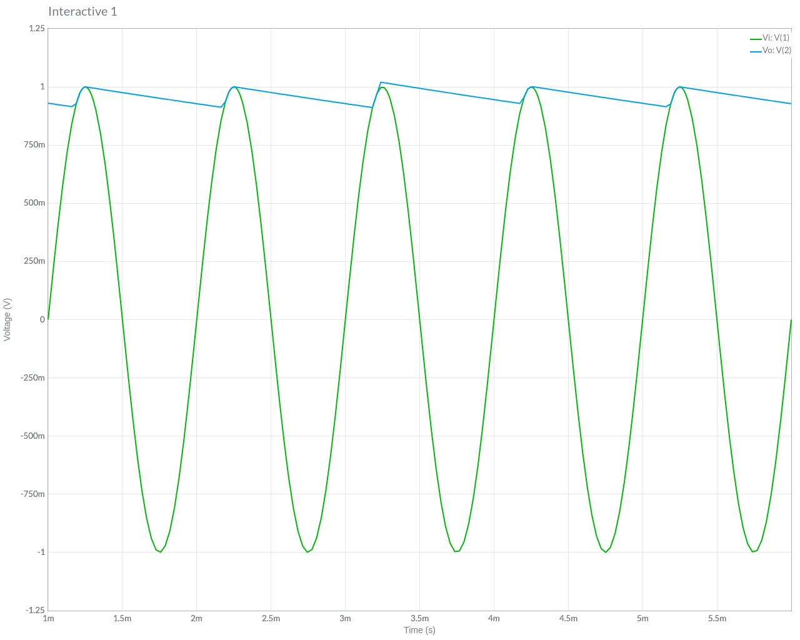

## Circuiti filtranti attivi e passivi

* Gaetano Conte - Corso di elettrotecnica ed elettronica Volume 2 (Modulo F)

## Generatori di segnale per basse e alte frequenze

* Millman - Microelettronica (Cap. 15)
* Storey -Electronics A Systems Approach 6th Edition (Cap. 23)

Per ottenere oscillatori a frequenze elevate si ricorre spesso alla struttura tipica a 3 punti come nell’oscillatore di Colpitts