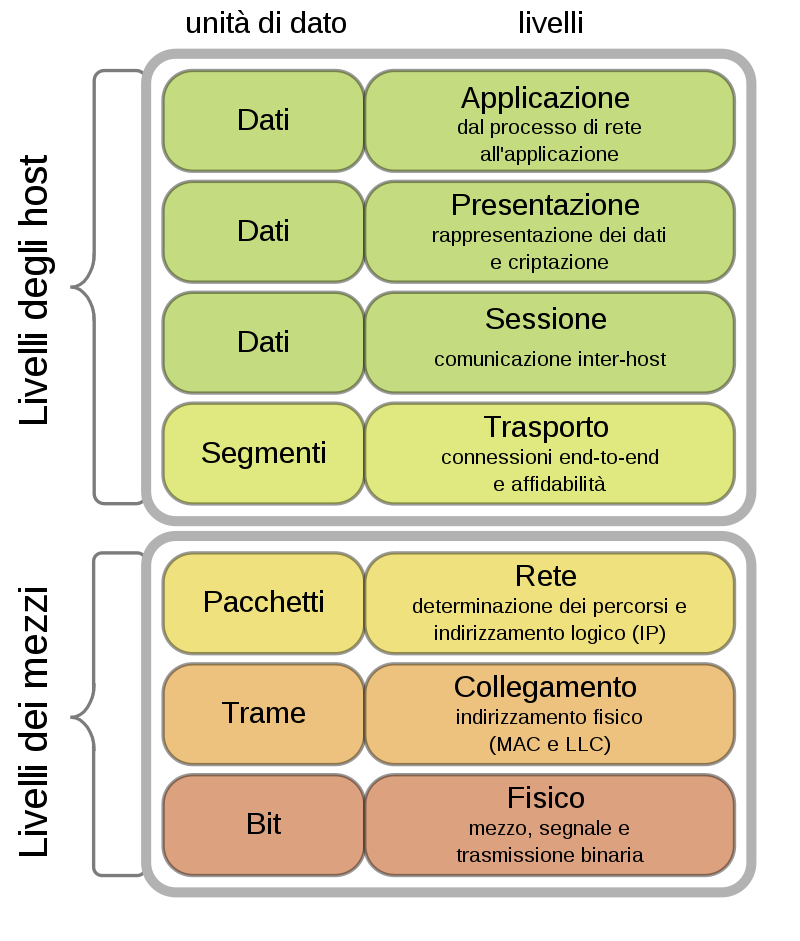

# Elementi di telecomunicazioni e trasmissione delle informazioni

## Caratteristiche fisiche dei segnali e relative rappresentazioni

* Ambrosini - Telecomunicazioni (Uda 3)

* Una tensione ad onda quadra con duty cycle pari al 50% e compresa tra 0V e 10V presenta secondo il teorema di Fourier un valore medio pari a 5V e solo armoniche dispari

## Elementi di teoria dell’informazione

* Ambrosini - Telecomunicazioni (Uda 11)

## Il canale di trasmissione

* Ambrosini - Telecomunicazioni (Uda 11, 14)

## Interazione canale-segnale

* La codifica Manchester viene utilizzata per codificare i bit da trasmettere

* La codifica di Hamming viene utilizzata per rilevare e correggere gli errori di trasmissione

## Mezzi trasmissivi e relative caratteristiche

* Ambrosini - Telecomunicazioni (Uda 10)

## Apparati e tecniche di sistemi di trasmissione e ricezione analogiche e digitali

* Ambrosini - Telecomunicazioni (Uda 12, 13)

Il rivelatore d’inviluppo è un demodulatore AM

* Il protocollo stop and wait per canali rumorosi prevede un tempo di attesa che dipende da numero di collisioni rilevate

## Parametri di qualità

## Caratteristiche delle reti a commutazione di circuito e di pacchetto

* Ambrosini - Telecomunicazioni (Uda 15)

## Organismi di standardizzazione, architetture e protocolli

* Nel modello OSI il protocollo UDP è un protocollo dello strato di trasporto senza handshake.

* Nel modello OSI il protocollo TCP è un protocollo dello strato di trasporto con handshake.

* Lo switch è un dispositivo tipico dello strato del livello 2 (data link)

* Il MAC address è stabilito dal produttore della scheda

* Con il protocollo CSMA/CD una stazione trasmittente rileva una collisione durante la trasmissione

  

## Reti locali e rete globale

* Il server DNS consente di individuare l’indirizzo IP di un sito cercato dato il suo nome

* Se il primo Byte di un indirizzo IP è 11001100, possiamo dire che si tratta di un IP di classe C

* L’indirizzo 135.12.6.4 fa parte di una rete di classe B

## Architettura, servizi e tendenze evolutive dei sistemi per la comunicazione in mobilità

* Ambrosini - Telecomunicazioni (Uda 15, 16)

## Architettura e servizi delle reti convergenti multi servizio

* Ambrosini - Telecomunicazioni (Uda 16)

## Sicurezza informatica, tecniche crittografiche e metodi di protezione.

* Ambrosini - Telecomunicazioni (pag. 540)